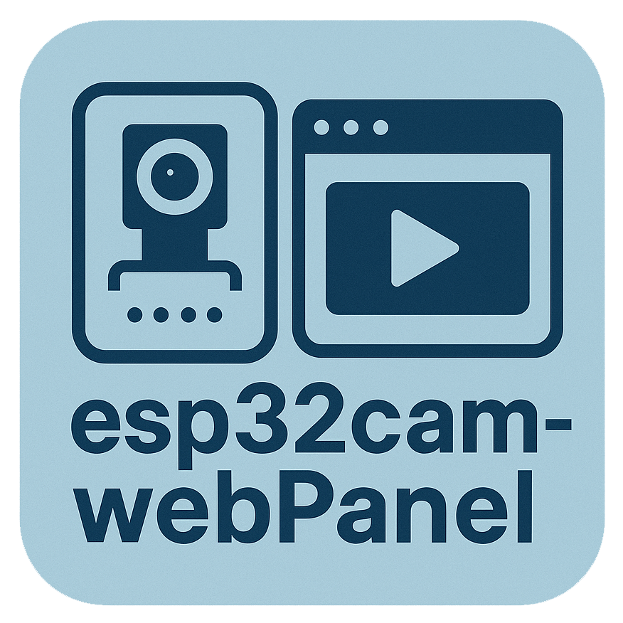

# esp32cam-webPanel



The esp32cam-webPanel is a project that captures the MJPEG video stream of the ESP32-CAM development board as images, and provides functions such as storage, logging, and real-time monitoring.  

### Need Modules:

- requests
- PIL
- flask

### Deployment Instructions:


```python
pip install requests
pip install pillow
pip install flask
```

```python
python run.py
```